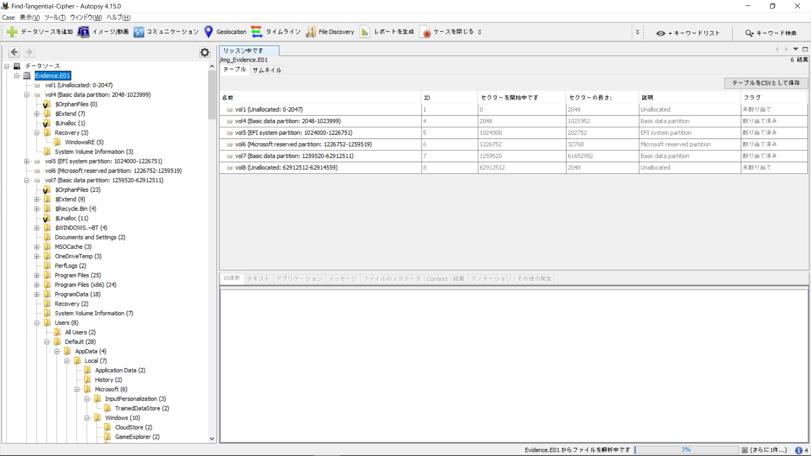
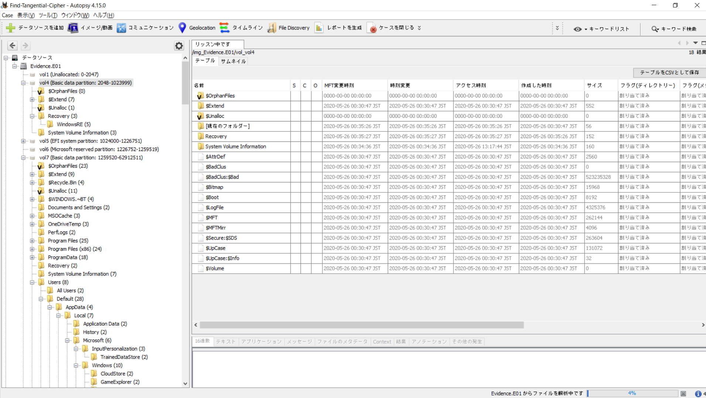
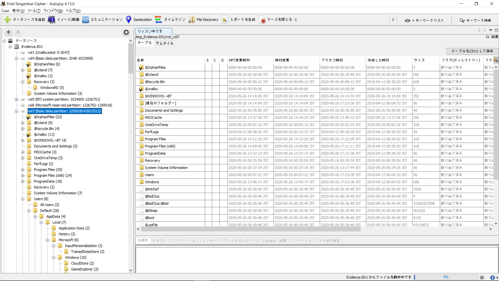
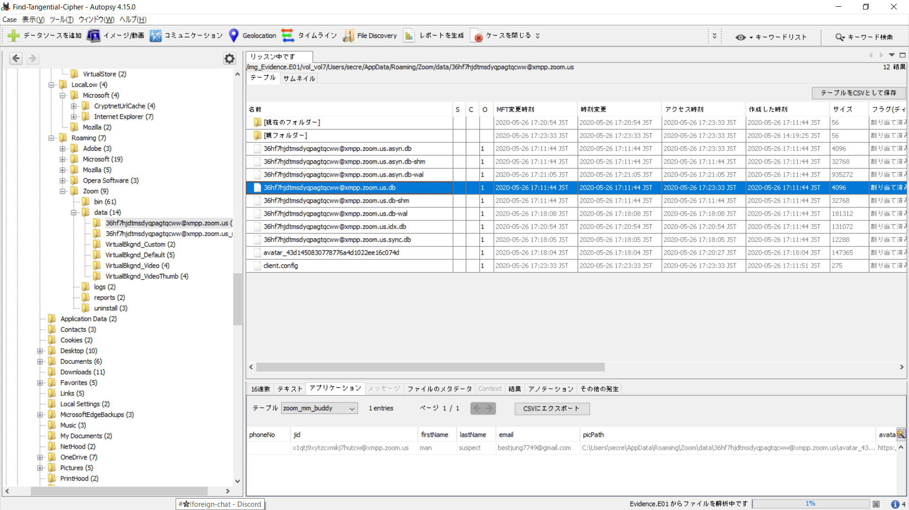
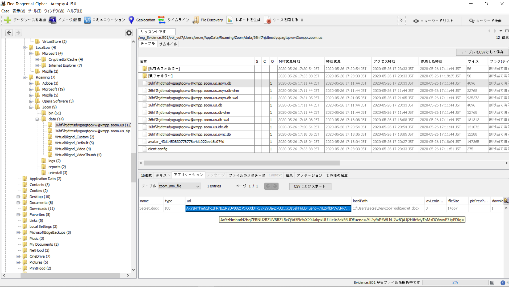
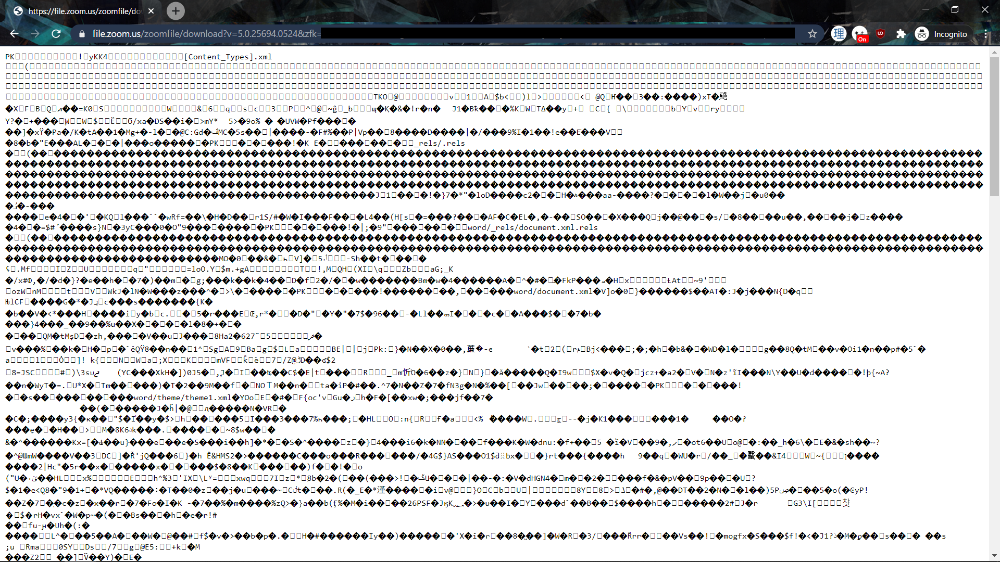
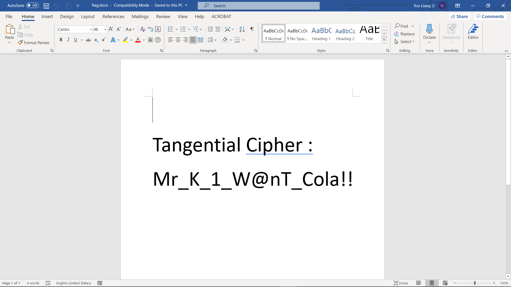

# Find Tangential Cipher

##### Category: Forensics | 3 solves 

We first-blooded this challenge thanks to my teammate Kenneth!

We are given a [Google Drive link](https://drive.google.com/drive/folders/1oQYvJnbOou5TUXaV1ApoQnP6S_Vj8pbI) with 9 files, named `Evidence.E01-8` and `Evidence.E01.txt`. The total file size is about 12 GB, so please check the link (if it is still alive) if  you want to try the question.

From the txt file, we can figure out that it's a physical image of a Windows system.

Opening up the image for browsing, we are greeted with different volumes. 



We tried them in order, starting from the first Basic data partition (vol 4) and finding that it's got nothing interesting.



Moving on to the next basic data partition on vol 7, we find something we're much more acquainted with - the `C:\` Drive Windows Filesystem!



Browsing around, we started with Appdata, going down the Default (skeleton) user and all the way down to `/User/secre` which seems to be the main user on this machine. We find many files, but nothing too interesting - until we reached the end of Appdata. There was this Zoom database where the `firstName:lastName` of a user was `man:suspect`.



We knew we were up to something now.

Moving on to the next db in the same folder, we found the message log in the first table of the db. As you can see in the image below, it goes like this:


```
Hello
Long Time No See
We're dealing with weapons
I want you to go to the meeting place and get it yourself.
The Tangential Cipher is in the File.
Then, I'll ask you.
```

The next db file only showed the xmpp id, so we skipped that. 

However, going back to the first db in the folder, in the `zoom_mm_file` table, we found a `url` column that looked suspiciously like the `objkey` in a Zoom download link. 



Putting that together into a link, we get a file shown below (I think `zfk` is my token so I'm not pasting the link here)



As the table mentioned that it was a `Secret.docx` file, we use `curl -o flag.docx <URL>` to download it and open it in Microsoft Word.

And we got the flag!




<details>
  <summary>FLAG</summary>
  
  Mr_K_1_W@nT_Cola!!
</details>