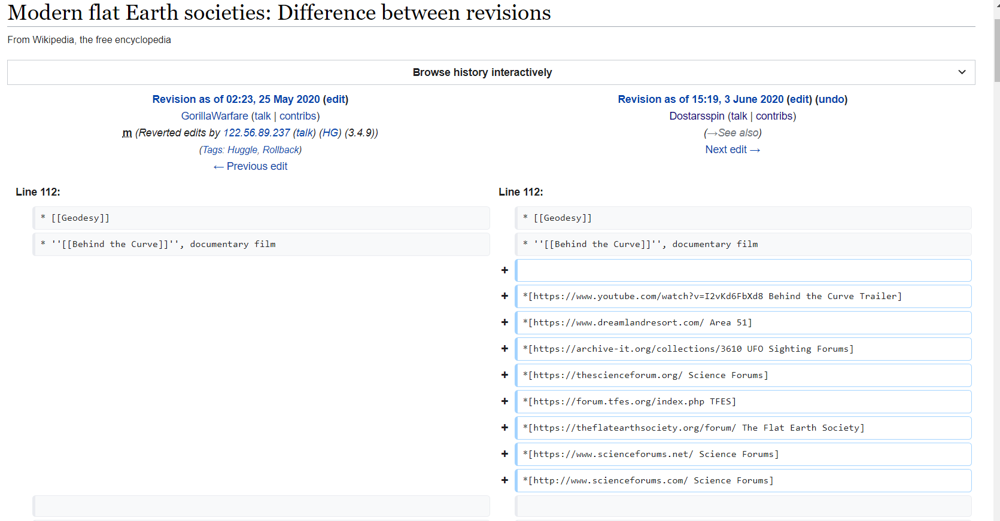
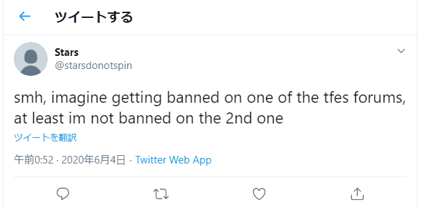
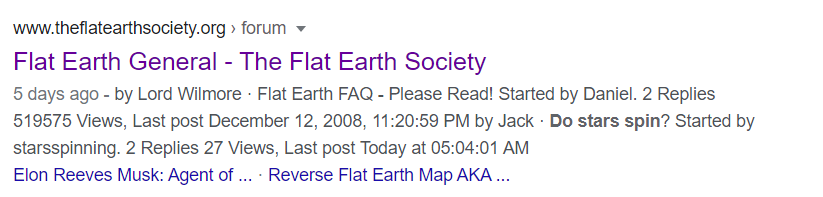
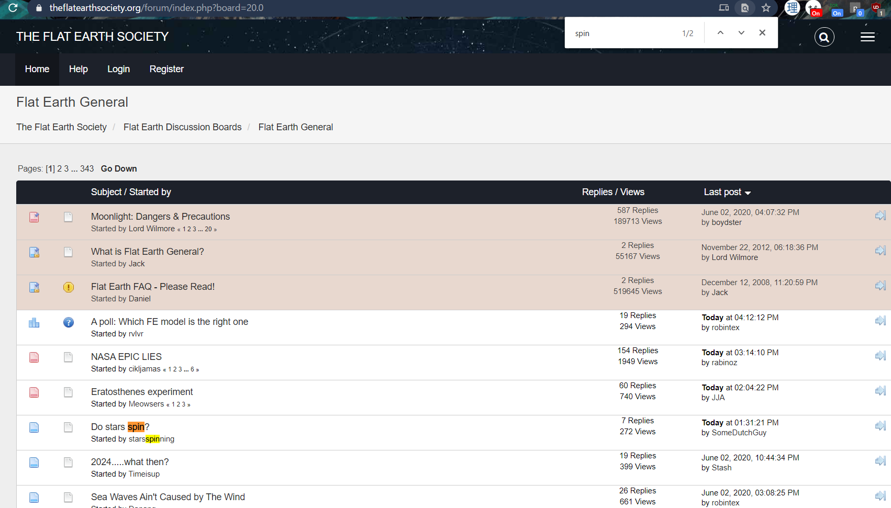
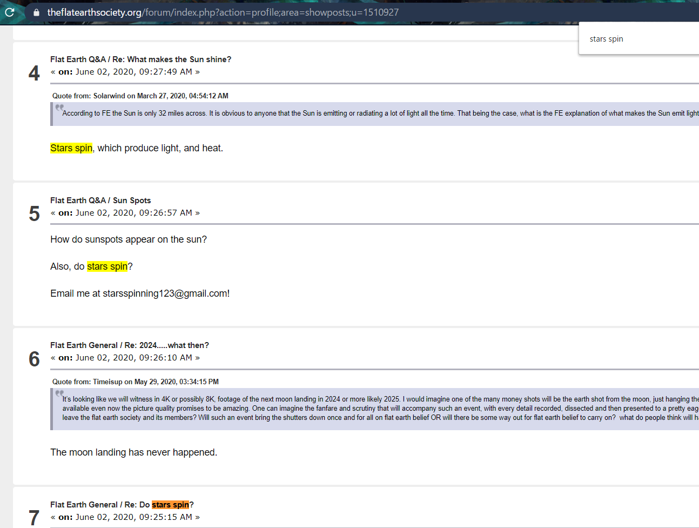
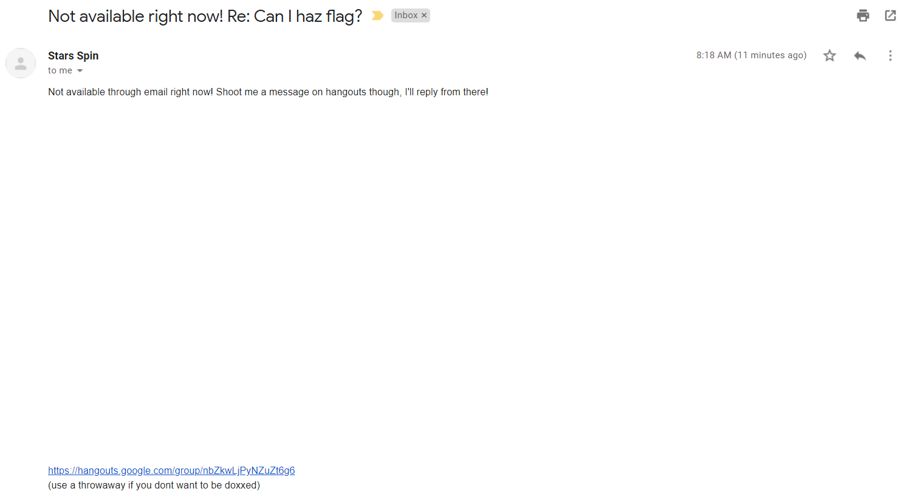
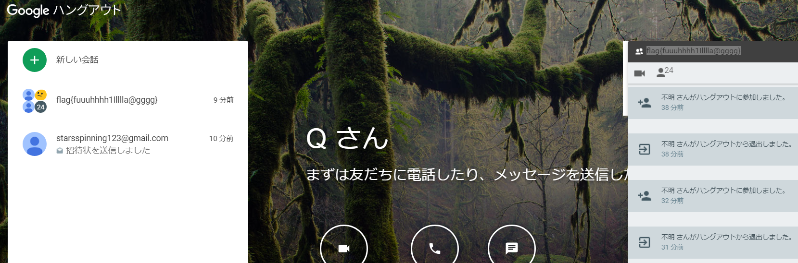

# Do Stars Spin? 3

##### Category: misc, osint

Continuing from the previous part, lets look at the user's posts.

There was [one edit which pointed to a freenode IRC channel](https://en.wikipedia.org/w/index.php?title=Internet_Relay_Chat&diff=prev&oldid=959459201) #starsdonotspin, but that was a red herring.

Going on, I noticed the user's largest edit was on [this wikipedia page](https://en.wikipedia.org/w/index.php?diff=960548445).

It has a list of links, so lets check them one by one. 

### [Youtube](https://www.youtube.com/watch?v=I2vKd6FbXd8)     
Most recent comment was one about stars spinning, but it was created AFTER the CTF has started so lets ignore that. It's probably by a player and not the challenge creator. The other comments were unrelated so lets move on to the next link.

### [Area 51 Site](https://www.dreamlandresort.com/)     
It looked too geocities, so I skipped it upon opening and put it in the backlog.

What caught my eye next was `*[https://forum.tfes.org/index.php TFES]` and `*[https://theflatearthsociety.org/forum/ The Flat Earth Society]`. You see, there was actually a hint on [the Twitter](https://twitter.com/starsdonotspin/status/1268209028414484481) about `TFES`, `forums` and `more than 1`. 

So i went straight to them.

Using Google, I found that someone posted about stars spinning has made a recent post on the [latter site](https://www.theflatearthsociety.org/forum/index.php?board=20.0).

The link was still live and I didn't have to use cache or webarchive.

Going through the user's post history, I noticed [one post](https://www.theflatearthsociety.org/forum/index.php?topic=86066.msg2254895#msg2254895) where the user posted his email address and clearly said to Email him.

At this point, I felt like a guess god, and I knew that this was the answer as I sent my email and got an automated reply within 1 minute.

I opened the [Hangouts link](https://hangouts.google.com/group/nbZkwLjPyNZuZt6g6) sent in the automated reply, and there was the flag.

  
FLAG

  
flag{fuuuhhhh1Illlla@gggg}

##### Time spent: 20 minutes
